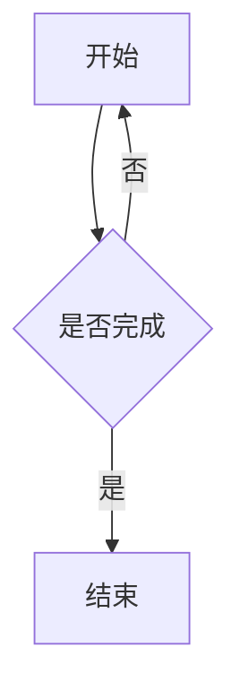

# Markdown 语法参考

本文记录当前项目已接入的 Markdown 语法。主要以文章、博客、动态、关于页、留言板使用的 `Markdown渲染器` 为准；AI 聊天气泡另有一套简化渲染规则，见文末说明。

相关实现位置：

- `packages/modules/文章/src/markdown-schema.ts`
- `packages/modules/文章/src/markdown.ts`
- `packages/modules/文章/src/composables/增强文章Markdown.ts`
- `packages/modules/文章/src/components/Markdown渲染器.vue`
- `packages/modules/文章/src/components/Markdown思维导图.vue`
- `packages/ui/src/components/AIChatWidget/MarkdownMessage.vue`

## 基础 Markdown

### 标题

```markdown
# 一级标题
## 二级标题
### 三级标题
#### 四级标题
##### 五级标题
###### 六级标题
```

# 一级标题
## 二级标题
### 三级标题
#### 四级标题
##### 五级标题
###### 六级标题

文章渲染时会给标题自动生成 `id`，并提取标题文本用于目录。

### 段落和换行

```markdown
这是一个段落。

这是另一个段落。
行尾加两个空格  
可以强制换行。
```

这是一个段落。

这是另一个段落。
行尾加两个空格\
可以强制换行。

普通单个换行仍按 Markdown 默认行为处理，不会强制生成 `<br>`。

### 强调

```markdown
**加粗**
__加粗__

*斜体*
_斜体_

***加粗斜体***
___加粗斜体___

~~删除线~~
```

**加粗**
__加粗__

*斜体*
_斜体_

***加粗斜体***
___加粗斜体___

~~删除线~~

### 行内代码

```markdown
使用 `npm run typecheck` 检查类型。
```

使用 `npm run typecheck` 检查类型。

### 代码块

````markdown
```ts
const message = '你好'
console.log(message)
```

~~~
没有语言标识的代码块
~~~
````

```ts
const message = '你好'
console.log(message)
```

~~~
没有语言标识的代码块
~~~

代码块由项目自定义渲染器接管，支持标题栏、行号、行高亮、终端样式、自动折叠等增强能力，详见“增强代码块”。

### 引用

```markdown
> 这是引用。
>
> 引用里可以继续写 **Markdown**。
```

> 这是引用。
>
> 引用里可以继续写 **Markdown**。

### 列表

```markdown
- 无序列表
- 无序列表
  - 嵌套列表

1. 有序列表
2. 有序列表
   1. 嵌套有序列表
```

- 无序列表
- 无序列表
  - 嵌套列表

1. 有序列表
2. 有序列表
   1. 嵌套有序列表

### 链接

```markdown
[站内链接](/articles/example)
[外部链接](https://example.com)
<https://example.com>
```

[站内链接](/articles/example)
[外部链接](https://example.com)
<https://example.com>

文章渲染器启用了 `linkify`，可识别裸 URL。外部 `http` / `https` 链接会自动添加 `target="_blank"` 和 `rel="noopener noreferrer"`。

### 邮箱链接

```markdown
[联系我](mailto:name@example.com)
```

[联系我](mailto:name@example.com)

渲染后会对 `mailto:` 做点击时解码处理，减少页面源码中直接暴露邮箱。

### 图片

```markdown


```


图片渲染时会自动：

- 经过项目文件 URL 解析逻辑处理。
- 添加 `loading="lazy"` 和 `decoding="async"`。
- 绑定 Fancybox 预览。
- 如果图片有 `alt`，且不在图集、Mermaid、GitHub 卡片等特殊容器内，会包成 `figure` 并显示图注。

### 表格

```markdown
| 字段 | 说明 |
| ---- | ---- |
| title | 标题 |
| content | 正文 |
```

| 字段 | 说明 |
| ---- | ---- |
| title | 标题 |
| content | 正文 |

文章表格会自动包一层横向滚动容器，便于移动端查看宽表格。

### 分割线

```markdown
---
***
___
```

---
***
___

### 原始 HTML

```markdown
<kbd>Ctrl</kbd> + <kbd>S</kbd>
<span style="color:red">红色文本</span>
```

<kbd>Ctrl</kbd> + <kbd>S</kbd>
<span style="color:red">红色文本</span>

文章渲染器开启了 `html: true`，因此可直接写 HTML。当前仓库是自用系统，未做严格 HTML 清洗，公开内容仍应避免粘贴不可信 HTML。

### 转义

```markdown
\*这不是斜体\*
\[这不是链接文本\]
```

\*这不是斜体\*
\[这不是链接文本\]

## 插件语法

### 任务列表

```markdown
- [ ] 未完成任务
- [x] 已完成任务
- [X] 也表示已完成
```

- [ ] 未完成任务
- [x] 已完成任务
- [X] 也表示已完成

### 高亮标记

```markdown
这是一段 ==高亮文本==。
```

这是一段 ==高亮文本==。

### 脚注

```markdown
这里引用一个脚注[^note]。

[^note]: 这是脚注内容。
```

这里引用一个脚注[^note]。

[^note]: 这是脚注内容。

### 缩写

```markdown
HTML 是一种标记语言。

*[HTML]: HyperText Markup Language
```

HTML 是一种标记语言。

*[HTML]: HyperText Markup Language

### Emoji 短码

```markdown
:smile: :rocket: :warning:
```

:smile: :rocket: :warning:

Emoji 使用 `markdown-it-emoji` 的 full 版本。

### KaTeX 数学公式

```markdown
行内公式：$E = mc^2$

块级公式：

$$
\int_0^1 x^2 dx = \frac{1}{3}
$$
```

行内公式：$E = mc^2$

块级公式：

$$
\int_0^1 x^2 dx = \frac{1}{3}
$$

由 `@vscode/markdown-it-katex` 渲染，样式来自 `katex/dist/katex.min.css`。

## 自定义语法

自定义语法的结构定义集中在 `packages/modules/文章/src/markdown-schema.ts`，运行时渲染器也会读取这份 schema。其他模块如果需要做编辑器补全、语法提示、校验或文档生成，可以通过以下入口复用：

```ts
import { Markdown自定义语法Schema } from '@personal-system/module-articles/markdown-schema'
```

维护规则：

- 新增或调整自定义语法时，先更新 `Markdown自定义语法Schema`。
- 渲染器、增强逻辑、编辑器提示和文档生成都应优先读取 schema，避免单独维护一份类型列表或元数据表。
- 本文下面的示例仍用于人工阅读；以 schema 和渲染器实现为准。

### GitHub 风格提示块

```markdown
> [!NOTE] 可选标题
> 这里是提示内容。

> [!WARNING]
> 没写标题时使用类型名作为标题。
```

> [!NOTE] 可选标题
> 这里是提示内容。

> [!WARNING]
> 没写标题时使用类型名作为标题。

支持类型：

```text
NOTE, TIP, IMPORTANT, WARNING, CAUTION,
ABSTRACT, SUMMARY, TLDR, INFO, TODO,
SUCCESS, CHECK, DONE, QUESTION, HELP, FAQ,
ATTENTION, FAILURE, MISSING, FAIL, DANGER,
ERROR, BUG, EXAMPLE, QUOTE, CITE
```

类型大小写在增强阶段按大写识别，最终样式类使用小写。

### 容器式提示块

```markdown
:::tip[自定义标题]
这里是提示内容。

- 可以包含列表
- 可以包含 **Markdown**
:::
```

:::tip[自定义标题]
这里是提示内容。

- 可以包含列表
- 可以包含 **Markdown**
:::

规则：

- 起始行格式为 `:::类型` 或 `:::类型[标题]`。
- 结束行必须是单独的 `:::`。
- 类型必须在 GitHub 风格提示块支持列表内。
- 代码块内部不会被识别为提示块。

### 缩进式提示块

```markdown
!!! note "自定义标题"
    这里是提示内容。

    - 内容需要比起始行多缩进
    - 可以包含 Markdown
```

!!! note "自定义标题"
    这里是提示内容。

    - 内容需要比起始行多缩进
    - 可以包含 Markdown

规则：

- 起始行格式为 `!!! 类型` 或 `!!! 类型 "标题"`。
- 内容必须比起始行多缩进，遇到缩进小于等于起始行的非空行结束。
- 标题里的 `\"` 会还原为 `"`，`\\` 会还原为 `\`。
- 类型不强制限制，但只有已配置样式的类型会有明确配色。

推荐类型与 GitHub 风格提示块保持一致。

### 折叠块

```markdown
??? warning "默认折叠"
    这里默认收起。

???+ tip "默认展开"
    这里默认展开。
```

??? warning "默认折叠"
    这里默认收起。

???+ tip "默认展开"
    这里默认展开。

规则：

- `??? 类型 "标题"` 生成默认折叠的 `<details>`。
- `???+ 类型 "标题"` 生成默认展开的 `<details open>`。
- 内容缩进规则与缩进式提示块一致。

### 标签页

```markdown
=== "pnpm"
    ```bash
    pnpm install
    ```

=== "npm"
    ```bash
    npm install
    ```
```

=== "pnpm"
    ```bash
    pnpm install
    ```

=== "npm"
    ```bash
    npm install
    ```

规则：

- 同一组标签页由连续的 `=== "标题"` 组成。
- 每个标签页内容必须比标签行多缩进。
- 第一项默认选中。
- 标签标题支持 `\"` 和 `\\` 转义。
- 标签页之间可以有空行，但不能插入其他同级内容。

### 图片网格

```markdown
[grid]


[/grid]
```

[grid]


[/grid]

也支持单行写法：

```markdown
[grid] [/grid]
```

[grid] [/grid]

规则：

- `[grid]` 和 `[/grid]` 独占行时，会收集两者之间的 Markdown。
- 同一行同时包含 `[grid]` 与 `[/grid]` 时，会处理该行中间内容。
- 未闭合的 `[grid]` 会原样输出。
- 代码块内部不会被识别为图片网格。

### GitHub 仓库卡片

```markdown
::github{repo="vuejs/core"}
```

::github{repo="vuejs/core"}

规则：

- `repo` 必须是 `owner/repo` 格式。
- 当前实现只匹配双引号写法。
- 前端会请求 `https://api.github.com/repos/{owner}/{repo}` 填充描述、语言、星标、Fork、许可证和头像。

### 剧透文本

```markdown
答案是 :spoiler[这里默认被遮住]。
```

答案是 :spoiler[这里默认被遮住]。

规则：

- 语法为 `:spoiler[内容]`。
- 内容按行内 Markdown 渲染。
- 点击或悬停后显示。
- `\]` 可以用于转义右方括号。

### Mermaid 图表

````markdown

````


规则：

- 语言标识必须是 `mermaid`。
- 前端会懒加载 Mermaid `11.12.0` 渲染图表。
- 支持深色主题切换后重新渲染。
- 支持拖拽、缩放、重置和全屏查看。
- Mermaid 代码块不会使用项目的增强代码块外框。

### 增强代码块

基础格式：

````markdown
```ts title="demo.ts" lineNumbers highlight={2} ins={3} del={4} frame=code wrap
const a = 1
console.log(a)
const b = 2
const oldValue = 0
```
````

```ts title="demo.ts" lineNumbers highlight={2} ins={3} del={4} frame=code wrap
const a = 1
console.log(a)
const b = 2
const oldValue = 0
```

支持的元数据：

| 元数据 | 示例 | 说明 |
| --- | --- | --- |
| 语言 | `ts`、`python`、`bash` | 第一段空白前内容作为语言 |
| 标题 | `title="demo.ts"`、`title='demo.ts'`、`title=demo.ts` | 显示在代码块标题栏 |
| 高亮行 | `highlight={1,3-5}` | 高亮指定行 |
| 独立高亮行 | `{1,3-5}` | 未写 `highlight=` 时也可识别 |
| 行号 | `showLineNumbers`、`lineNumbers`、`linenos`、`ln` | 显示行号 |
| 显式行号开关 | `lineNumbers=true`、`lineNumbers=false` | 显式开启或关闭 |
| 起始行号 | `startLineNumber=10`、`startLine=10`、`lineNumberStart=10` | 行号从指定数字开始，最小为 1 |
| 插入行 | `ins={2,4-6}` | 标记为新增行，左侧显示 `+` |
| 删除行 | `del={3}` | 标记为删除行，左侧显示 `-` |
| 外框 | `frame=code`、`frame=terminal`、`frame=none` | 普通代码框、终端框、无外框 |
| 自动换行 | `wrap` 或 `wrap=true` | 长行换行显示 |
| 保留缩进 | `preserveIndent` | 需要与 `wrap` 同时使用 |

行范围格式：

```text
1
1,3,5
1-4
1,3-5,8
```

其他行为：

- 没有语言时按 `text` 渲染。
- 超过 18 行的代码块会自动折叠，显示“展开剩余 N 行”。
- `frame=terminal` 会显示终端窗口控制点。
- `frame=none` 不显示项目外框和标题栏。

当前已注册高亮语言：

```text
bash, c, cpp, csharp, css, dart, diff, dockerfile, go, graphql,
ini, java, javascript, json, kotlin, less, lua, makefile, markdown,
nginx, plaintext, powershell, python, ruby, rust, scss, sql,
typescript, xml, yaml
```

当前语言别名：

```text
bat -> powershell
c# -> csharp
c++ -> cpp
conf -> nginx
console -> bash
cs -> csharp
docker -> dockerfile
env -> ini
gql -> graphql
htm/html -> xml
js/jsx -> javascript
jsonc -> json
kt/kts -> kotlin
md/mdx -> markdown
plain/text/txt -> plaintext
powershell/ps1 -> powershell
py/pyi -> python
rb -> ruby
rs -> rust
shell/shellscript/sh/zsh -> bash
styl -> css
ts/tsx -> typescript
vue -> xml
yml -> yaml
```

## 思维导图视图

文章编辑器和阅读器可使用 `Markdown思维导图` 组件把 Markdown 转为 Markmap。

```markdown
# 根节点

## 分支一

- 子项 A
- 子项 B

## 分支二

### 更深层级
```

行为说明：

- 主要依赖标题、列表等结构化 Markdown。
- 如果传入了文章标题，且正文没有一级标题，会自动把文章标题补成一级标题。
- 如果正文开头存在 Frontmatter 块，组件会跳过 Frontmatter 后再判断是否需要补标题。
- 这是独立视图能力，不代表文章正文渲染器支持 Frontmatter 元数据解析。

## 当前不作为正文语法处理的内容

- Frontmatter：正文渲染器不会把 `---` 包裹的 YAML 当元数据解析。
- `markdown-it-sub`、`markdown-it-sup`、`markdown-it-ins`：依赖树中可能存在，但当前文章渲染器没有注册这些插件。
- MDX / Vue 组件语法：正文渲染器只按 HTML 和 Markdown 处理，不执行组件。

## AI 聊天气泡简化 Markdown

AI 聊天窗口中的消息不是文章渲染器，只支持以下简化规则：

```markdown
# 一级标题
## 二级标题
### 三级标题

- 无序列表
* 无序列表

**加粗**
`行内代码`
[链接](https://example.com)
```

限制：

- 只识别 `h1` 到 `h3`。
- 只识别 `-` 和 `*` 无序列表。
- 链接只允许 `http://` 或 `https://`。
- 不支持代码块、表格、图片、脚注、数学公式、自定义提示块等文章语法。
